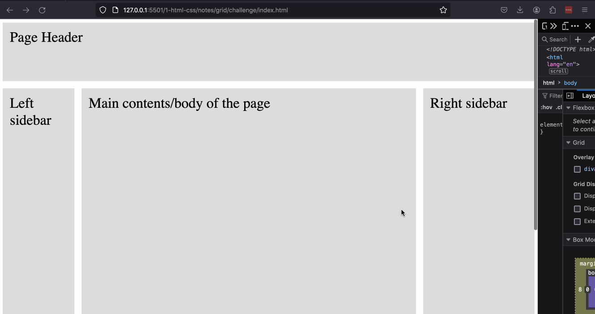

# CSS Assignment #2: Grid

#### Project setup

Start by copying (not moving!) the files from this folder, [index.html](index.html) and [style.css](style.css), into an assignment folder inside your code folder. Open the HTML file with your Live Server, and then start editing the CSS to meet the requirements described here.

#### Requirements:

You goal is to make the page look like this:

You must use CSS Grid properties. The left column should be a fixed size, and right sidebar should be a dynamic size.

There is no need to make any changes to the html.

#### Tips:

-   You can use column and row definitions, or grid areas. Either way works just as well.
-   Reference the [CSS Tricks Guide to CSS Grid](https://css-tricks.com/snippets/css/complete-guide-grid/) to help you
-   When you are ready to submit, remember to make a pull request following the steps in our [Git Steps](../../../git-steps.md) document.
