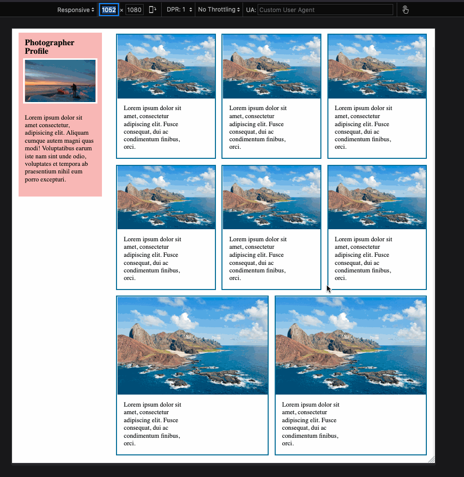

# CSS Assignment #3: Responsive Design

#### Project setup

Start by copying (not moving!) the files from this folder, [index.html](index.html), [style.css](style.css), and ocean.jpg into an assignment folder inside your code folder. Open the HTML file with your Live Server, and then start editing the CSS to meet the requirements described here.

CSS has been provided for a mobile version of the site. Reduce your browser size or use the "responsive viewport mode" in your browser's devtools to see what it will look like in a width smaller than 500px.

### Requirements:

You will add three media queries to add three new responsive layouts. The regular, mobile version of the site doesn't use either flexbox or grid to create the layout. It only uses flexbox for centering the header.

### 500px

At `min-width: 500px` use flexbox to make the layout look like this:

### 750px

At `min-width: 750px` add more flexbox properties to make the layout look like this:

### 1000px

At `min-width: 1000px` use CSS grid to make the layout look like this:

#### Tips:

-   Start by thoroughly reading the HTML to make sure you understand how the elements on the page are organized
-   Remember that only **direct children** of flex/grid containers are flex/grid items that are subject to the flex/grid rules.
-   When you are ready to submit, remember to make a pull request following the steps in our [Git Steps](../../../git-steps.md) document.
