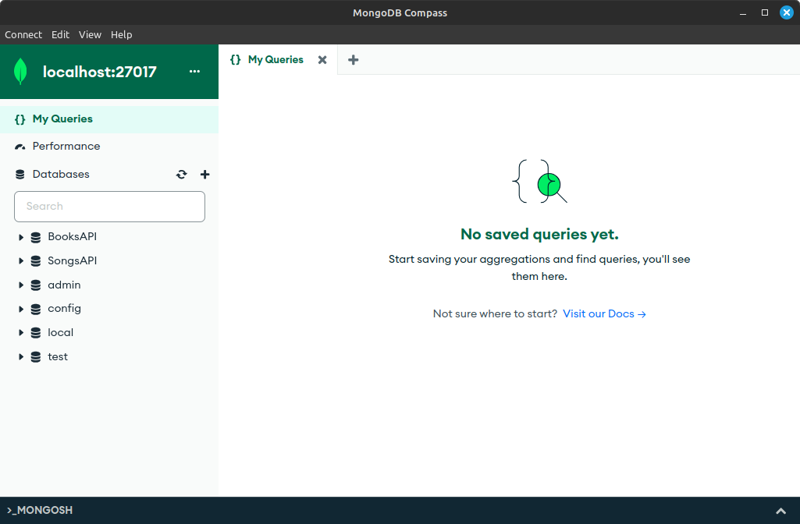

# MongoDB Setup - MacOS

## Install MongoDB Service

1.  Run the following commands one after the other in your terminal to install mongoDB

    - `brew tap mongodb/brew`
    - `brew install mongodb-community`

1.  Then run the following command to test it:

    - `brew services start mongodb/brew/`
    - `mongodb-community`

You may be able to find troubleshooting help on [this installation page](https://docs.mongodb.com/manual/tutorial/install-mongodb-on-os-x/).

### Homebrew trouble?

If the previous instructions gave you errors specifically related to Homebrew, you may not have configured homebrew correctly when you installed it at the beginning of this course. Follow these instructions to complete your homebrew installation and configuration.

Go back to the [homebrew home page](https://brew.sh/) and run the installation command again in your terminal. (It is okay to do this if homebrew is already installed, it doesn't hurt anything to do it twice.) There will be a lot of output in your terminal, look at the very bottom of the output. The last purple arrow should say "Next Steps", followed by two commands The first command starts with `(echo...`, make sure you paste it entirely including the parns. The second command starts with `eval...`

After you have run those two commands, go back to the beginning of these instructions and try again.

## Install MongoDB Compass

**NOTE**: MongoDB Compass is usually installed automatically when MongoDB Community Edition is installed via the official installer. The first step is to check whether it has installed correctly. If not, proceed with the following instructions.

1. Try to open Compass on your computer, in whatever way you normally open applications.
1. If it's there and opens, you're done with this section! If not, proceed to install it separately

1. Visit the MongoDB Compass installation instructions <https://docs.mongodb.com/compass/master/install/>
1. Download MongoDB Compass from <https://www.mongodb.com/try/download/compass>
1. Run the installer from your Downloads folder
1. Accept the default values for installation location and options

## Verify Installation and Connect

1. Open Compass
1. Click the green "Connect" button
1. If you see a red box that says `connect ECONNREFUSED 127.0.0.1:27017`, you just need to start the service in the background. Run `brew services start mongodb-community` in your terminal. Then try clicking the green Connect button again.

It should now look something like this:

## If something goes wrong...

We will be troubleshooting individual MongoDB install problems on Saturday, Sep. 14. If you miss that day, you can stay after class on another day to ask for help.
