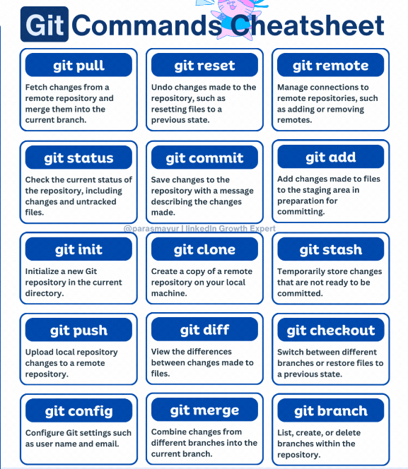

# 📚 Full Stack Software Engineering

This is the central repository for IBT Learning's Full Stack Software Engineering program. This cohort begins on April 27, 2024.

## Author

👨‍💻 **Author:** [Danny Burrow](https://github.com/burrowdown)

## Support

🛠️ **Support:** [Adesoji1](https://github.com/Adesoji1)

## Assignments

### HTML & CSS

| Week | Topic            | Link                                                                                                        |
| ---- | ---------------- | ----------------------------------------------------------------------------------------------------------- |
| 2    | 📝 Markdown      | [Markdown Assignment](0-getting-ready/markdown-assignment.md)                                               |
| 3    | 🌐 HTML          | [HTML Assignment #1](1-html-css/basics/assignment-1.md)                                                     |
| 4    | 🎨 CSS           | [CSS Assignment #1 (Flexbox)](1-html-css/flexbox/flexbox-assignment/css-assignment-1.md)                    |
| 5    | 🎨 CSS           | [CSS Assignment #2 (Grid)](1-html-css/grid/grid-assignment/css-assignment-2.md)                             |
| 5    | 🎨 CSS           | [CSS Assignment #3 (Responsive Design)](1-html-css/media-queries/responsive-assignment/css-assignment-3.md) |
| 6    | 🌐 HTML & 🎨 CSS | [HTML & CSS Final Project](1-html-css/blog-project.md)                                                      |

### JavaScript

| Week | Topic               | Link                                                  |
| ---- | ------------------- | ----------------------------------------------------- |
| 7    | Strings and Numbers | [JS Assignment #1](./2-javascript/js-assignment-1.md) |
| 9    | Booleans            | [JS Assignment #2](./2-javascript/js-assignment-2.md) |
| 9    | Conditionals        | [JS Assignment #3](./2-javascript/js-assignment-3.md) |
| 9    | Loops               | [JS Assignment #4](./2-javascript/js-assignment-4.md) |

## Tools

Git is a distributed version control system that tracks versions of files. It is often used to control source code by programmers collaboratively developing software.for more information, click [here](git-resources/gitcheatsheet.md)

## Useful links

🔗 [GitHub's git cheat sheet](https://education.github.com/git-cheat-sheet-education.pdf) (this one is more succinct)

🔗 [FreeCodeCamp's git cheat sheet](https://www.freecodecamp.org/news/git-cheat-sheet/) (this one goes into more detail)

🔗 [Markdown cheat sheet](https://www.markdownguide.org/cheat-sheet/)

🔗 [HTML Elements reference](https://developer.mozilla.org/en-US/docs/Web/HTML/Element)

🔗 [CSS Tricks Guide to Flexbox](https://css-tricks.com/snippets/css/a-guide-to-flexbox/)

🔗 [CSS Tricks Guide to CSS Grid](https://css-tricks.com/snippets/css/complete-guide-grid/)

🔗 [CSS Tricks Guide to Media Queries](https://css-tricks.com/a-complete-guide-to-css-media-queries/) (this goes much more in depth than was covered in the lesson)

🔗 [CSS Selector Reference](https://www.w3schools.com/cssref/css_selectors.php)
