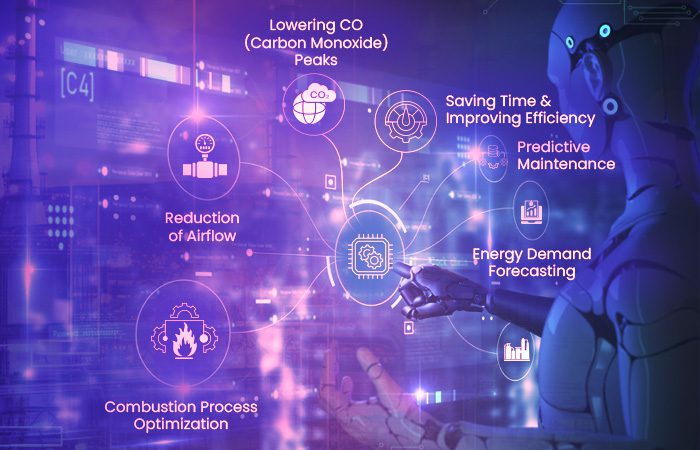

# Trying out Markdown Syntaxes

### ARTIFICIAL INTELLIGENCE
### This article explores Artificial Intelligence 
***AI***

*AI's imapct on today's world*

> In today's rapidly evolving world, Artificial Intelligence stands as a transformative force, revolutionizing industries and shaping the course of our future.

1. AI's impact on healthcare.
2. AI's role in transportation.
3. AI's influence on customer service.

- AI-powered virtual assistants.
- AI-driven recommendation systems.
- AI-based image recognition technology.


`AI: The Future is Now`

---

[World's powerful AI](https://www.pycodemates.com/2023/02/top-5-worlds-most-advanced-ai-systems.html#:~:text=Gemini%20is%20an%20AI%20system,most%20versatile%20model%20ever%20built.)



| Topic        | Description   |
| ----------- | ----------- |
| AI in Healthcare | Revolutionizing patient care |
| AI in Finance   | Transforming financial services   |
| AI in Education | Enhancing learning experiences   |

```
{
  topic":    AI in Healthcare",
  impact":   Revolutionizing patient care",
  benefits": Improved diagnosis", Personalized treatment plans
}
```

### AI: Pioneering the Future{#custom-id}

	AI
: Atrificial Intelligence

~~AI will replace all human jobs.~~

- [1] Test the neural network
- [2] Train the machine learning model
- [4] Update the website
- [5] Contact the media

That AI joke was funnny! :joy:

AI is growing at a very ==fast and powerful==

A~I~

A^I^

